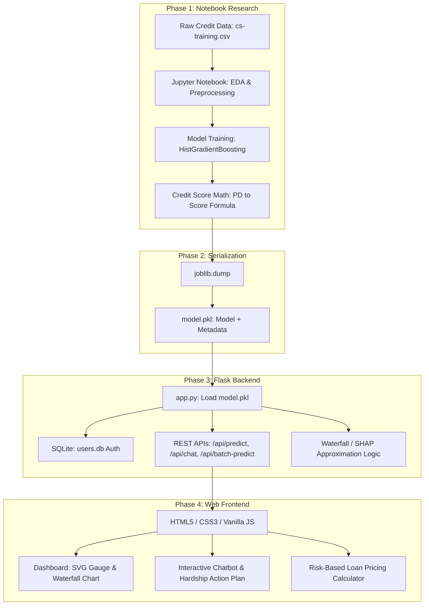

# 📊 CreditScore AI – Intelligent Credit Scoring & Risk-Based Pricing System

**CreditScore AI** là một hệ thống ứng dụng tài chính thông minh (Fintech) được xây dựng để đánh giá rủi ro tín dụng của khách hàng cá nhân dựa trên các thuật toán Học máy (Machine Learning) tiên tiến. Ứng dụng cung cấp các công cụ phân tích rủi ro, dự đoán xác suất vỡ nợ (Probability of Default - PD), quy đổi điểm tín dụng chuẩn quốc tế (300 - 850), định giá khoản vay tối ưu theo mức rủi ro, và giải thích quyết định của mô hình AI (Explainable AI - XAI).

---

## ✨ Các tính năng cốt lõi

### 1. 🔐 Hệ thống Xác thực An toàn (User Authentication)
- Màn hình đăng nhập/đăng ký dạng **kính mờ (Glassmorphic Auth Overlay)** bảo vệ hệ thống, ngăn chặn truy cập trái phép vào Dashboard.
- Mã hóa mật khẩu bảo mật một chiều bằng thuật toán băm **PBKDF2** thông qua thư viện `werkzeug.security`.
- Lưu trữ tài khoản người dùng bằng cơ sở dữ liệu **SQLite** (`users.db`).
- Duy trì phiên đăng nhập an toàn bằng cơ chế **Flask Session** (cookie được ký mã hóa).
- Tự động hiển thị tên người dùng và tạo avatar chữ cái đầu tiên (ví dụ: `Huy` ➔ `H`).

### 2. 🎯 Đánh giá Điểm tín dụng Cá nhân (Personal Credit Scoring)
- Biểu mẫu nhập liệu trực quan với **tooltip hướng dẫn chi tiết** cho từng biến tài chính.
- Trực quan hóa điểm tín dụng bằng biểu đồ đồng hồ đo (**Gauge Chart**) và phân lớp rủi ro từ *Excellent* (Xanh) đến *Very Poor* (Đỏ).
- Phân tích các nhân tố tài chính tác động tích cực hoặc tiêu cực đến điểm số.
- **Giải thích AI (Explainable AI - XAI)**: Biểu đồ thác nước (**Waterfall Chart**) mô phỏng cách mô hình cộng/trừ điểm tín dụng từ mức trung vị (Baseline) của tập dữ liệu dựa trên hồ sơ khách hàng.

### 3. 🤖 Trợ lý ảo tư vấn tài chính (NLP Chatbot)
- Cho phép người dùng nhập thông tin hồ sơ tài chính bằng ngôn ngữ tự nhiên (ví dụ: *"Tôi 35 tuổi, thu nhập 5000 USD, tỷ lệ sử dụng thẻ 20%..."*).
- Bộ phân tích cú pháp ngôn ngữ tự nhiên **Rule-based NLP Parser** tự động bóc tách các chỉ số tài chính từ câu thoại để chấm điểm trực tiếp trong khung chat.

### 4. 📂 Chấm điểm tín dụng Hàng loạt (Batch Scoring)
- Tải lên danh sách hàng nghìn khách hàng dưới dạng file **CSV** hoặc **Excel** (`.xlsx`, `.xls`).
- **Thuật toán tự động ánh xạ cột (Column Mapping)**: Tự động nhận diện và chuẩn hóa tên cột tiếng Anh hoặc tiếng Việt (có dấu/không dấu, ví dụ: `thunhap` / `tuổi` / `MonthlyIncome` ➔ chuẩn hóa cột dữ liệu đầu vào của mô hình).
- Xuất file kết quả đã chấm điểm bao gồm các trường điểm tín dụng dự báo, xác suất vỡ nợ và xếp hạng rủi ro để tải xuống nhanh chóng.

### 5. 💰 Định giá Khoản vay theo Mức rủi ro (Risk-Based Pricing)
- Tự động điều chỉnh lãi suất cho vay (Interest Rate) và phê duyệt hạn mức tối đa (Max Approved Limit) dựa trên điểm tín dụng.
- Người dùng có thể kéo trượt số tiền vay và chọn các kỳ hạn trả nợ (12 - 60 tháng).
- Tự động lập lịch trả nợ chi tiết hàng tháng (**Amortization Schedule**) hiển thị rõ số tiền gốc, tiền lãi và số dư giảm dần.

### 6. 📈 Kế hoạch hành động Cải thiện điểm tín dụng (Improvement Roadmap)
- Chạy thử nghiệm giả lập thay đổi chỉ số (**What-if Analysis**) để xem điểm số biến động tức thời.
- Tự động đề xuất lộ trình hành động thiết thực được thiết kế theo dạng ngăn kéo trượt mở rộng (**Collapsible Detailed Action Plan**) với các hướng dẫn chi tiết dành riêng cho từng hạng mục rủi ro của bạn.

---

## 🎯 Phạm vi dự án (In-Scope & Out-of-Scope)

### 1. Trong phạm vi dự án (In-Scope)
*   **Đánh giá & Chấm điểm tín dụng**:
    *   Thuật toán chấm điểm tín dụng quy đổi từ Xác suất vỡ nợ (PD) sang thang điểm FICO tiêu chuẩn ($300 - 850$) sử dụng công thức toán học PDO (Points to Double the Odds).
    *   Chạy mô hình học máy `HistGradientBoostingClassifier` được huấn luyện sẵn trên tập dữ liệu Kaggle *"Give Me Some Credit"* (150,000 dòng).
    *   Hỗ trợ điền tự động dữ liệu khuyết thiếu bằng thống kê trung vị (median stats) của tập dữ liệu huấn luyện.
*   **Xác thực người dùng & Phân quyền (RBAC)**:
    *   Đăng ký, Đăng nhập, Đăng xuất người dùng thông qua mã hóa bảo mật mật khẩu PBKDF2 bằng SQLite (`users.db`).
    *   Phân chia vai trò rõ ràng giữa **Khách hàng cá nhân (`borrower`)** và **Chuyên viên tín dụng (`analyst`)**.
    *   Ẩn/hiển thị động các tính năng trên giao diện tùy theo vai trò đăng nhập.
*   **Chấm điểm hàng loạt (Batch Scoring)**:
    *   Tải lên danh sách dữ liệu định dạng CSV, XLS, XLSX.
    *   Hệ thống tự động chuẩn hóa dấu tiếng Việt và ánh xạ các tên cột phổ biến về chuẩn đầu vào đặc trưng của mô hình.
    *   Xuất và tải xuống tệp kết quả chấm điểm.
*   **Giải thích AI (Explainable AI - XAI)**:
    *   Sử dụng thuật toán so sánh tuyến tính xấp xỉ SHAP để tính toán đóng góp điểm của từng thuộc tính so với trung vị tập mẫu (Baseline).
    *   Vẽ biểu đồ thác nước dạng ngang (Waterfall Chart) để giải thích quá trình tăng/giảm điểm của AI.
*   **Tương tác Trợ lý ảo (Chatbot NLP)**:
    *   Hộp chat trôi nổi cho phép nhập thông tin tài chính bằng ngôn ngữ tự nhiên.
    *   Phân tích cú pháp Regex để tự động bóc tách các đặc trưng tài chính trực tiếp trong khung chat.
*   **Định giá Khoản vay (Risk-Based Pricing)**:
    *   Lập lịch trả nợ đều hàng tháng (EMI) và bảng khấu hao dư nợ giảm dần dựa trên mức lãi suất điều chỉnh tự động theo điểm tín dụng.
*   **Giả lập Khủng hoảng (Macroeconomic Stress Testing)**:
    *   Cho phép Analyst trượt chọn các kịch bản suy thoái vĩ mô (giảm thu nhập, tăng gánh nặng nợ, tăng sử dụng thẻ) để áp dụng thử nghiệm lên toàn bộ danh mục khách hàng đã chấm điểm.
    *   Hiển thị biểu đồ kép dịch chuyển rủi ro (Risk Tier Shifts) và tính toán tỷ lệ hồ sơ bị hạ cấp chất lượng.
*   **Gợi ý sản phẩm (Credit Matchmaker)**:
    *   Đề xuất thẻ tín dụng và khoản vay phù hợp dựa trên điểm tín dụng.
    *   Tự động tính toán Tỷ lệ duyệt thành công (Approval Odds %) dựa trên ngưỡng underwriting của ngân hàng đối tác.

### 2. Ngoài phạm vi dự án (Out-of-Scope)
*   **Đồng bộ hóa dữ liệu thời gian thực với CIC / Ngân hàng Nhà nước**:
    *   Dự án không kết nối trực tiếp với cổng thông tin tín dụng quốc gia (CIC) hoặc các ngân hàng thực tế để truy xuất thông tin tự động mà dựa trên dữ liệu người dùng nhập hoặc tải lên qua file mẫu.
*   **Hệ thống giải ngân và giao dịch tiền tệ**:
    *   Dự án không có cổng thanh toán, không xử lý giao dịch tài chính, chuyển tiền hoặc phê duyệt giải ngân thực tế (các tính năng định giá khoản vay và đăng ký mở thẻ chỉ mang tính chất giả lập minh họa).
*   **Tích hợp LLM đám mây thương mại (GPT-4 / Gemini API trực tiếp trên Cloud)**:
    *   Chatbot hoạt động dựa trên bộ phân tích cú pháp Regex nội bộ (Rule-based NLP) để bảo mật thông tin tài chính và chạy offline không tốn chi phí API, không tích hợp các mô hình Generative AI lớn từ bên thứ ba.
*   **Hệ thống quản lý định danh cấp độ cao (KYC / eKYC)**:
    *   Dự án không xác thực danh tính bằng CCCD, nhận diện khuôn mặt hay chữ ký số. Mọi tài khoản được xác thực qua cơ chế đăng nhập email/mật khẩu cơ bản.
*   **Tự động cập nhật / Huấn luyện lại mô hình trực tuyến (Online Learning / Auto-retraining)**:
    *   Mô hình máy học `model.pkl` là tĩnh (static) và được huấn luyện offline. Dự án không hỗ trợ tự động huấn luyện lại mô hình khi có dữ liệu mới phát sinh từ người dùng trên Web.

---

## 📐 Phương pháp đề xuất (Proposed Method)

Dự án được triển khai theo một quy trình khép kín (End-to-End Pipeline) từ nghiên cứu thực nghiệm dữ liệu (Notebook) đến phát triển ứng dụng web tương tác (Web App). Sơ đồ dưới đây mô tả luồng xử lý và kiến trúc hệ thống:



### 1. Nghiên cứu & Huấn luyện Mô hình (Jupyter Notebook)
*   **Tiền xử lý & EDA**: Dữ liệu từ bộ dữ liệu *"Give Me Some Credit"* chứa các giá trị khuyết thiếu (ở thuộc tính `MonthlyIncome` và `NumberOfDependents`). Trong Notebook, chúng tôi khám phá phân phối và xác định cơ chế xử lý khuyết thiếu.
*   **Huấn luyện Mô hình**: Thực nghiệm nhiều thuật toán (như Logistic Regression, Random Forest, Gradient Boosting). Thuật toán **HistGradientBoostingClassifier** được lựa chọn nhờ khả năng xử lý các thuộc tính khuyết thiếu tự động (Native handling), tốc độ xử lý nhanh trên tập dữ liệu lớn (150,000 dòng) và cho độ chính xác cao nhất (ROC-AUC ~ `0.87`).
*   **Toán học Quy đổi Điểm tín dụng (Credit Score)**: Thay vì chỉ trả về xác suất mặc định (PD), chúng tôi thiết lập công thức chuyển đổi sang thang điểm FICO tiêu chuẩn ngân hàng ($300 - 850$) dựa trên chỉ số **PDO (Points to Double the Odds)**:
    $$\text{Factor} = \frac{\text{PDO}}{\ln(2)}$$
    $$\text{Offset} = \text{Base Score} - \text{Factor} \times \ln\left(\frac{PD}{1 - PD + 10^{-10}}\right)$$
    *Thiết lập hệ thống: Base Score = 600 (tương ứng odds 1:1), PDO = 50. Điểm số được giới hạn (clip) trong khoảng [300, 850].*

### 2. Đóng gói & Chuyển giao Mô hình (Serialization)
*   Để nhúng mô hình vào ứng dụng web, mô hình đã huấn luyện được đóng gói bằng `joblib` thành tệp `model.pkl`.
*   Tệp này chứa cấu trúc mô hình, danh sách cột đặc trưng (`feature_cols`), số liệu hiệu năng (`metrics`) và **thống kê trung vị (median stats)** của từng biến số từ tập dữ liệu gốc để phục vụ việc điền dữ liệu khuyết thiếu khi người dùng không nhập đủ ở web form hoặc chatbot.

### 3. Triển khai API Web Server (Flask Backend)
*   Khi Flask khởi động, tệp `model.pkl` được tải lên bộ nhớ một lần duy nhất để tối ưu hiệu năng.
*   **Thuật toán giải thích XAI (Waterfall/SHAP)**: Tại API `/api/predict`, Backend tính toán mức đóng góp của từng đặc trưng bằng phương pháp so sánh tuyến tính: tính điểm số giả định khi thay thế đặc trưng đó bằng giá trị trung vị (Baseline) của tập dữ liệu. Độ lệch điểm ($\Delta S = S_{\text{test}} - S_{\text{baseline}}$) phản ánh chính xác tác động tăng/giảm điểm của đặc trưng đó.
*   **API Xử lý Ngôn ngữ Tự nhiên (/api/chat)**: Xây dựng bộ lọc Regex thông minh phân tích cú pháp chuỗi văn bản từ Chatbot thành các tham số tài chính tương ứng.
*   **API Chấm điểm Hàng loạt (/api/batch-predict)**: Tiếp nhận file dữ liệu lớn, tự động chuẩn hóa các ký tự đặc biệt và ánh xạ tiêu đề cột (tự động dịch các cột tiếng Việt/tiếng Anh không chuẩn về biến đầu vào của mô hình) và ghi tệp kết quả.

### 4. Thiết kế & Trực quan hóa Giao diện (Web Frontend)
*   **Gauge Chart (SVG Động)**: Javascript nhận điểm tín dụng từ API, ánh xạ góc quay kim đồng hồ đo từ $-90^{\circ}$ (ứng với 300 điểm) đến $+90^{\circ}$ (ứng với 850 điểm) trực quan hóa trên SVG.
*   **Waterfall Chart**: Sử dụng các thanh ngang HTML/CSS được định vị tuyệt đối so với trục trung vị ($50\%$), tô màu xanh (tác động tốt) và đỏ (tác động xấu) biểu diễn mức độ đóng góp điểm tín dụng.
*   **Pricing Calculator & Amortization Schedule**: Nhận lãi suất vay và hạn mức tối đa phê duyệt từ Backend, tính toán công thức trả nợ đều hàng tháng (EMI) và vẽ bảng khấu hao giảm dần tự động trên Client-side.
*   **Roadmap Accordion**: Cung cấp giao diện trượt mở rộng mượt mà chứa các kế hoạch hành động chi tiết tương thích với điểm số rủi ro của người dùng.

---

## 🛠️ Công nghệ sử dụng

### Backend (Python/Flask)
- **Flask**: Máy chủ RESTful API xử lý logic xác thực và dự báo.
- **Scikit-Learn**: Huấn luyện và dự đoán bằng thuật toán `HistGradientBoostingClassifier` (độ chính xác ROC-AUC đạt ~0.87, hệ số Gini ~0.74, KS ~0.58).
- **SQLite3**: Cơ sở dữ liệu lưu trữ tài khoản người dùng.
- **Pandas & Numpy**: Xử lý và chuẩn hóa dữ liệu hàng loạt.
- **Joblib**: Đóng gói mô hình máy học đã huấn luyện (`model.pkl`).

### Frontend (HTML5 / CSS3 / Vanilla JS)
- Giao diện xây dựng hoàn toàn bằng **Vanilla CSS3** và **HTML5** thuần giúp tối ưu hiệu năng tải trang.
- **Vanilla Javascript** điều khiển toàn bộ tương tác Single Page Application (SPA), biểu đồ SVG và gọi REST API.
- Google Material Icons & Inter Font.

---

## ⚙️ Hướng dẫn Khởi chạy ứng dụng (Windows)

Dự án cung cấp sẵn hai tệp tập lệnh `.bat` giúp quản lý server dễ dàng:

### 1. Khởi chạy Server
Bạn chỉ cần nhấp đúp vào tệp **`start.bat`** ở thư mục gốc của dự án. File này sẽ tự động:
- Kiểm tra và dừng các tiến trình đang chiếm cổng `5000` (nếu có).
- Khởi chạy máy chủ Flask ở chế độ nền (`python backend/app.py`).
- Lưu trữ logs hoạt động vào tệp `server.log`.
- Tự động mở trình duyệt và truy cập trang web tại địa chỉ: `http://localhost:5000`.

### 2. Dừng Server
Khi không sử dụng nữa, bạn nhấp đúp vào tệp **`stop.bat`**. Tệp này sẽ:
- Tìm kiếm tiến trình đang chạy Flask trên cổng `5000` và dừng hẳn tiến trình đó (`taskkill`).
- Dọn dẹp và xóa các tệp tin logs tạm thời (`server.log`).

---

## 📁 Cấu trúc thư mục dự án

```text
CreditRiskInFintech/
├── backend/
│   ├── app.py            # Flask Web Server & REST API endpoints
│   ├── train_model.py    # Script tiền xử lý và huấn luyện mô hình ML
│   ├── model.pkl         # File lưu trữ mô hình và metadata đã đóng gói
│   └── users.db          # Cơ sở dữ liệu SQLite lưu trữ tài khoản người dùng
├── frontend/
│   ├── index.html        # Trang giao diện chính (SPA Dashboard)
│   ├── style.css         # Thiết kế giao diện (Design System & Animations)
│   └── app.js            # Điều khiển logic giao diện, chatbot & gọi API
├── start.bat             # Tập lệnh khởi chạy nhanh server
├── stop.bat              # Tập lệnh dừng server
├── cs-training.csv       # Dữ liệu huấn luyện (Give Me Some Credit - Kaggle)
├── cs-test.csv           # Dữ liệu thử nghiệm
├── UIUX.png              # Hình ảnh mô tả thiết kế giao diện
└── README.md             # Tài liệu hướng dẫn dự án
```
